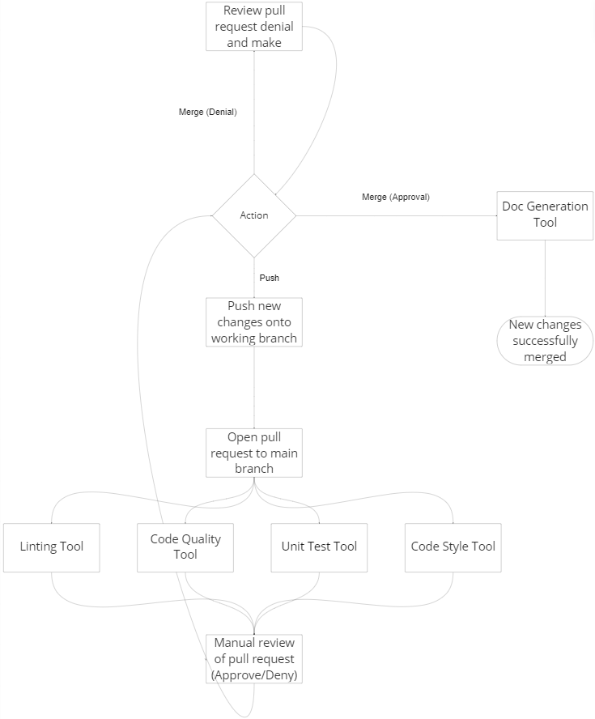

# CI/CD Pipeline - Phase 1

## Checkpoint 1 - 11/14

## What is currently functional
- Pull Requests
  - Manual code quality via human review
  - Last step before new changes will be officially merged onto the main branch

- ESLint 
  - Static code analysis tool for identifying problematic patterns found in JavaScript code
  - Linting will run on pull requests

- Codacy
  - Automated code analysis/quality tool that helps ship better software, faster
    - Analyzes each commit or pull request by running all supported static code analysis tools for the languages found in your repository.
    - Codacy dashboard also goes into depth about code analysis.
  - Code quality checks will only reflect code on the main branch

- Jest
  - JavaScript testing framework 
  - Unit testing will run on pull requests to the main branch

## What is planned (in progress)
- Jest
  - Implementation might be modified based on lab (Lab Week 8 - Unit & E2E Testing)

- JSDocs
  - Markup language used to annotate JavaScript source code files
  - Documentation would be created on successful merging

## Current pipeline workflow
