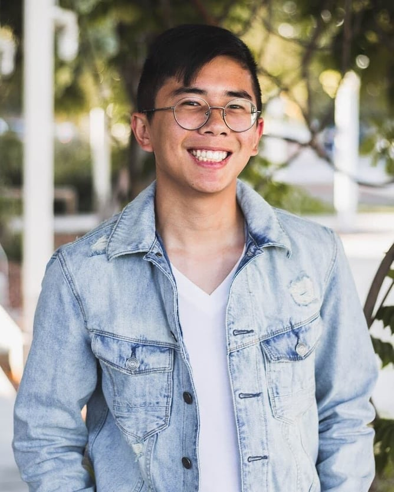
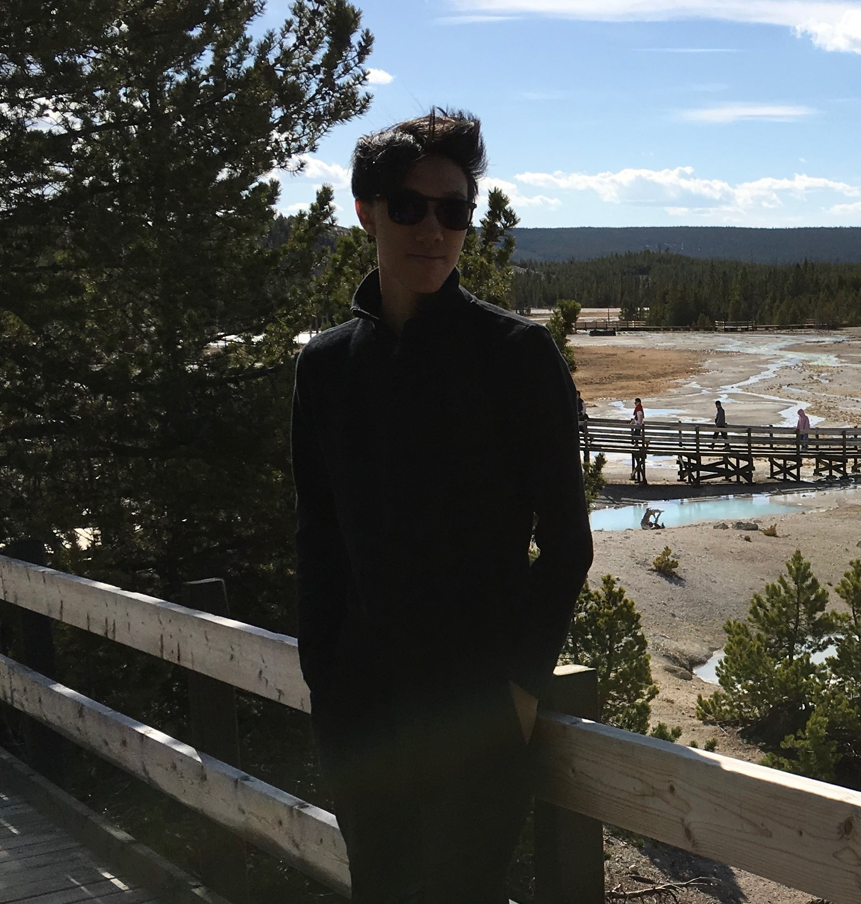
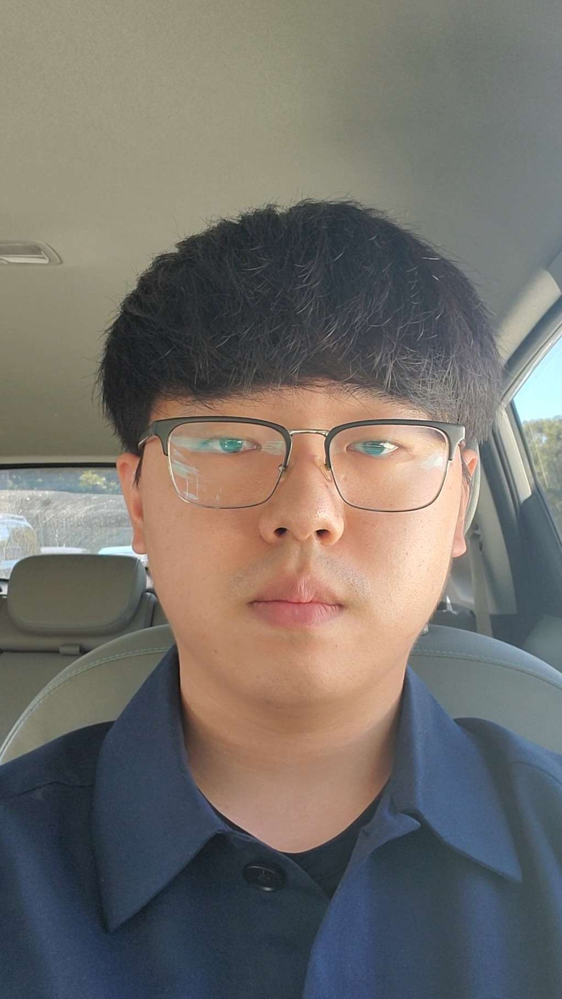
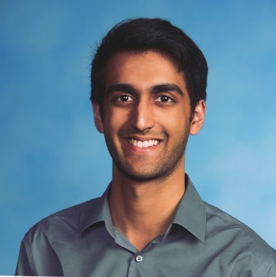
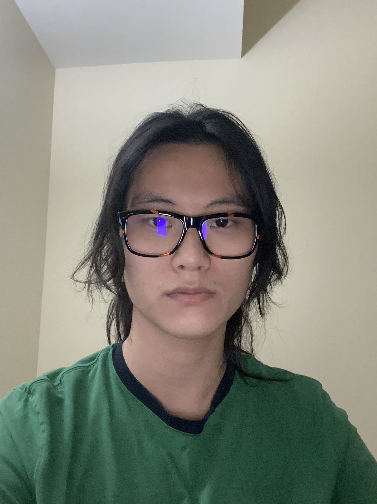

# CSE110-FA22-GROUP17

## Team Name: Team Clueless

## Team Values:
- Teamwork
- Openness
- Communication
- Adaptability 
- Focus

## Team Members: 
- ### Alex Wang: Developer with focus on backend and CI/CD pipeline
  > Fourth Year, Computer Engineering, Warren College  
  > - Personal Github Page: https://alw002.github.io/  
  
- ### Aiden Jee: Backend
  > Fourth Year, CS Major in Muir College
  > - Personal Github Page: https://github.com/minpapajee
  
- ### Alan Wen: Team Lead
  > Fourth Year CS Major, transferred from UCD in 2021. Sixth College, Former Apple Intern
  > - Personal Github Page: https://github.com/ajwboi
  
- ### Alwin Low: Front End (CSS & HTML)
  > Fourth Year CS Major in ERC College
  > - Personal Github Page: https://github.com/AstralWin
   
- ### Raon Choi: [Frontend]
  > Fourth year Math/CSE Major. Marshall College
  > - Personal Github Page: https://github.com/h1choi0918
  
- ### Sameer Jain: Backend / QA
  > Third year Computer Science major, Sixth College.  
  > - Personal Github Page: https://github.com/anonsameer
  
- ### Sohil Nadarajan: [Backend]
  > Third year, Math CS major, Revelle College
  > - Personal Github Page: https://github.com/SohilNadarajan
  > 
- ### Yiyang Chen: [Frontend]
  > Second Year CS major from Marshall College. 
  > - Personal Github Page: https://github.com/yic076 
  > 
- ### Yuheng Ge: Team Lead
  > Senior CS student from ERC college.
  > - Personal Github Page: https://github.com/GYH1208
  > 
  
